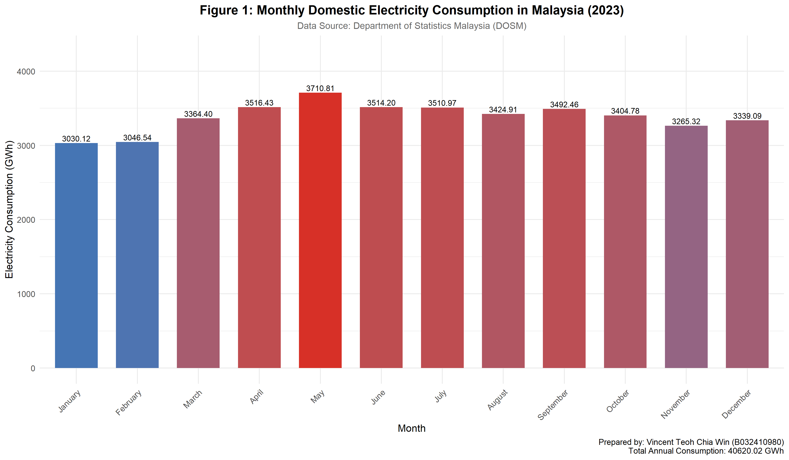

# Assignment 2: Statistics Report
## Malaysian Electricity Consumption Analysis

---

### Student Information
| Field | Details |
|-------|---------|
| **Name** | Vincent Teoh Chia Win |
| **Matric No** | B032410980 |
| **Data Source** | Department of Statistics Malaysia (DOSM) |

---

## Question 1 (20 marks)

### Data Description
This analysis uses real Malaysian electricity consumption data obtained from the Department of Statistics Malaysia (DOSM). The cleaned dataset (`electricity_consumption.csv`) contains monthly domestic (local household) electricity consumption in Malaysia for the year 2023, consisting of 12 monthly observations.

---

## Question 1(a): Identification of Population, Sample, and Variable

### I. Population

**Answer:** The **population** consists of ALL monthly domestic (local household) electricity consumption values in Malaysia across ALL time periods.

**Elaboration:** 
- The population represents the complete set of all possible observations that could be collected
- This includes all historical monthly consumption data from all Malaysian households (past records)
- It also encompasses all future monthly consumption data that could potentially be collected
- The population is theoretically infinite as it extends indefinitely into the future
- In practical terms, it includes all monthly domestic electricity consumption records from all regions and time periods in Malaysia

---

### II. Sample

**Answer:** The **sample** is the 12 monthly observations of domestic electricity consumption in Malaysia for the year 2023.

**Elaboration:**
- Sample size: **n = 12 observations** (one for each month of 2023)
- The sample is a subset of the population, selected for analysis
- This sample represents one year (2023) of monthly consumption data
- Each observation represents the total domestic electricity consumption for a specific month
- The sample is a **time series sample** as it consists of sequential monthly measurements

---

### III. Variable of Interest

**Answer:** The **variable of interest** is the monthly domestic (local household) electricity consumption in Malaysia, measured in **GWh (Gigawatt-hours)**.

**Elaboration:**
- This is a **quantitative continuous variable** as it can take any numerical value within a range
- The variable measures the total amount of electricity consumed by domestic/household users
- Unit of measurement: **Gigawatt-hours (GWh)**
- The variable captures the aggregate consumption from all Malaysian households for each month

---

## R Code Commands

```r
# ============================================================================
# QUESTION 1: Malaysian Electricity Consumption Analysis
# ============================================================================
# Assignment by: Vincent Teoh Chia Win (B032410980)
# Data Source: Department of Statistics Malaysia (DOSM)
# ============================================================================

# Load required libraries
library(ggplot2)

# Set working directory and load data
data <- read.csv("C:/Users/Vincent/Desktop/Assignment2/Data/electricity_consumption.csv")

# View data structure
head(data)
str(data)

# Filter for domestic (local_domestic) electricity consumption in 2023
data$date <- as.Date(data$date)
data$year <- format(data$date, "%Y")
data$month <- format(data$date, "%B")

# Extract 2023 domestic consumption data
domestic_2023 <- data[data$sector == "local_domestic" & data$year == "2023", ]
print(domestic_2023)

# Calculate descriptive statistics
consumption_values <- domestic_2023$consumption
cat("Sample Size (n):", length(consumption_values))
cat("Mean:", mean(consumption_values))
cat("Median:", median(consumption_values))
cat("Standard Deviation:", sd(consumption_values))
cat("Variance:", var(consumption_values))
```

---

## Data and Results

### 2023 Domestic Electricity Consumption Data

| Month | Consumption (GWh) |
|-------|-------------------|
| January | 3,030.1166 |
| February | 3,046.5429 |
| March | 3,364.3961 |
| April | 3,516.4268 |
| May | 3,710.8076 |
| June | 3,514.2000 |
| July | 3,510.9708 |
| August | 3,424.9106 |
| September | 3,492.4616 |
| October | 3,404.7752 |
| November | 3,265.3190 |
| December | 3,339.0938 |

---

### Descriptive Statistics

| Statistic | Value |
|-----------|-------|
| Sample Size (n) | 12 observations |
| Minimum | 3,030.1166 GWh |
| Maximum | 3,710.8076 GWh |
| Range | 680.6910 GWh |
| Mean (X̄) | 3,385.0018 GWh |
| Median | 3,414.8429 GWh |
| Standard Deviation (s) | 196.9928 GWh |
| Variance (s²) | 38,806.1521 GWh² |
| Total Annual Consumption | 40,620.0211 GWh |

---

## Figures

### Figure 1: Monthly Domestic Electricity Consumption in Malaysia (2023)



**Description:** This bar chart displays the monthly domestic electricity consumption in Malaysia for 2023. The chart shows that consumption peaked in May (3,710.81 GWh) and was lowest in January (3,030.12 GWh). The color gradient indicates the relative consumption levels.

---

### Figure 2: Trend of Monthly Domestic Electricity Consumption (2023)


**Description:** This line chart illustrates the trend of monthly domestic electricity consumption throughout 2023. The green dashed line represents the mean consumption (3,385.00 GWh). The chart shows an increasing trend from January to May, followed by relatively stable consumption with slight decrease toward the end of the year.

---

## Appendix: Detailed Calculations

### A. Raw Data Summary

| Row | Date | Sector | Consumption (GWh) |
|-----|------|--------|-------------------|
| 295 | 2023-01-01 | local_domestic | 3030.117 |
| 296 | 2023-02-01 | local_domestic | 3046.543 |
| 297 | 2023-03-01 | local_domestic | 3364.396 |
| 298 | 2023-04-01 | local_domestic | 3516.427 |
| 299 | 2023-05-01 | local_domestic | 3710.808 |
| 300 | 2023-06-01 | local_domestic | 3514.200 |
| 301 | 2023-07-01 | local_domestic | 3510.971 |
| 302 | 2023-08-01 | local_domestic | 3424.911 |
| 303 | 2023-09-01 | local_domestic | 3492.462 |
| 304 | 2023-10-01 | local_domestic | 3404.775 |
| 305 | 2023-11-01 | local_domestic | 3265.319 |
| 306 | 2023-12-01 | local_domestic | 3339.094 |

### B. Mean Calculation

$$\bar{X} = \frac{\sum X}{n} = \frac{40620.02}{12} = 3385.002 \text{ GWh}$$

### C. Median Calculation

Sorted Values: 3030.117, 3046.543, 3265.319, 3339.094, 3364.396, **3404.775**, **3424.911**, 3492.462, 3510.971, 3514.200, 3516.427, 3710.808

$$\text{Median} = \frac{X_6 + X_7}{2} = \frac{3404.775 + 3424.911}{2} = 3414.843 \text{ GWh}$$

### D. Variance and Standard Deviation Calculation

| X | (X - X̄) | (X - X̄)² |
|---|---------|----------|
| 3030.117 | -354.885 | 125,943.47 |
| 3046.543 | -338.459 | 114,554.40 |
| 3265.319 | -119.683 | 14,323.95 |
| 3339.094 | -45.908 | 2,107.54 |
| 3364.396 | -20.606 | 424.59 |
| 3404.775 | 19.774 | 390.99 |
| 3424.911 | 39.909 | 1,592.72 |
| 3492.462 | 107.460 | 11,547.61 |
| 3510.971 | 125.969 | 15,868.20 |
| 3514.200 | 129.198 | 16,692.19 |
| 3516.427 | 131.425 | 17,272.54 |
| 3710.808 | 325.806 | 106,149.48 |
| **Total** | **0** | **426,867.70** |

Sample Variance:
$$s^2 = \frac{\sum(X - \bar{X})^2}{n-1} = \frac{426867.70}{11} = 38806.15 \text{ GWh}^2$$

Sample Standard Deviation:
$$s = \sqrt{s^2} = \sqrt{38806.15} = 196.99 \text{ GWh}$$

---

## Question 1(b): Population Parameter Identification

### The Population Parameter Being Estimated

**Answer:** The population parameter being estimated is:

$$\mu \text{ (mu)} = \text{THE POPULATION MEAN of monthly domestic electricity consumption in Malaysia}$$

---

### Explanation: Population Mean vs Population Proportion

This represents a **POPULATION MEAN (μ)**, NOT a population proportion (p).

#### Reasons:

**1. Nature of the Variable:**
- The variable 'monthly domestic electricity consumption' is a **QUANTITATIVE CONTINUOUS** variable measured in GWh (Gigawatt-hours)
- It represents measurable quantities, not categories or counts

**2. What We Are Estimating:**
- We want to estimate the TRUE AVERAGE (mean) monthly domestic electricity consumption across ALL time periods in Malaysia
- The sample mean (X̄) is used to estimate the population mean (μ)

**3. Population Mean vs Population Proportion Comparison:**

| Aspect | Population Mean (μ) | Population Proportion (p) |
|--------|---------------------|---------------------------|
| Data Type | Quantitative data | Categorical data |
| Measures | Central tendency | Fraction/percentage |
| Variable Values | Any numeric value in a range | Only two outcomes (success/failure) |
| Example | Average consumption | Proportion of months with consumption > 3500 GWh |

**4. In This Context:**
- We are measuring AVERAGE monthly consumption (a continuous quantity)
- We are NOT counting how many months fall into a specific category
- Therefore, the parameter is **μ (population mean)**

---

### Mathematical Representation

| Component | Symbol | Description |
|-----------|--------|-------------|
| Population Parameter | μ | True mean monthly domestic electricity consumption in Malaysia |
| Point Estimator | X̄ | Sample mean (calculated from sample data) |
| Estimation Formula | X̄ = (ΣXᵢ) / n | Sum of all observations divided by sample size |

---

### Point Estimate Calculation

$$\bar{X} = \frac{\sum X_i}{n} = \frac{40620.0211}{12} = 3385.0018 \text{ GWh}$$

The sample mean **X̄ = 3,385.0018 GWh** is our **POINT ESTIMATE** of the population mean μ (the true average monthly domestic electricity consumption in Malaysia).

---

### R Code for Question 1(b)

```r
# Load data
data <- read.csv("C:/Users/Vincent/Desktop/Assignment2/Data/electricity_consumption.csv")

# Filter for domestic (local_domestic) electricity consumption in 2023
data$date <- as.Date(data$date)
data$year <- format(data$date, "%Y")

# Extract 2023 domestic consumption data
domestic_2023 <- data[data$sector == "local_domestic" & data$year == "2023", ]
consumption_values <- domestic_2023$consumption

# Calculate point estimate of population mean
sample_mean <- mean(consumption_values)
sample_n <- length(consumption_values)
sample_sum <- sum(consumption_values)

cat("Sum of observations (ΣXᵢ):", sample_sum, "GWh\n")
cat("Sample size (n):", sample_n, "observations\n")
cat("Sample Mean (X̄):", sample_mean, "GWh\n")
```

---

### Summary Box for Question 1(b)

| Component | Details |
|-----------|---------|
| **Population Parameter** | μ (mu) - Population Mean |
| **Definition** | The true average monthly domestic electricity consumption in Malaysia (in GWh) |
| **Type** | POPULATION MEAN (not a proportion) |
| **Reason** | The variable is quantitative and continuous, measuring electricity consumption in GWh, not a categorical/binary outcome |
| **Point Estimate** | X̄ = 3,385.0018 GWh |

---

## Question 1(c): Sample Mean Calculation and Point Estimate

### Step 1: Raw Data

| Month | Consumption (Xᵢ) in GWh |
|-------|-------------------------|
| January | 3,030.116610 |
| February | 3,046.542903 |
| March | 3,364.396075 |
| April | 3,516.426793 |
| May | 3,710.807649 |
| June | 3,514.200000 |
| July | 3,510.970801 |
| August | 3,424.910593 |
| September | 3,492.461578 |
| October | 3,404.775217 |
| November | 3,265.319040 |
| December | 3,339.093809 |

---

### Step 2: Sample Mean Calculation

#### Formula for Sample Mean:

$$\bar{X} = \frac{\sum X_i}{n} = \frac{X_1 + X_2 + X_3 + ... + X_n}{n}$$

Where:
- X̄ = Sample mean
- Xᵢ = Individual observations (i = 1, 2, 3, ..., n)
- n = Sample size (number of observations)
- Σ = Summation symbol (sum of all values)

#### Step-by-Step Calculation:

**Step 2.1: Sum all monthly consumption values (ΣXᵢ)**

$$\sum X_i = 3030.1166 + 3046.5429 + 3364.3961 + 3516.4268 + 3710.8076 + 3514.2000$$
$$+ 3510.9708 + 3424.9106 + 3492.4616 + 3404.7752 + 3265.3190 + 3339.0938$$

$$\sum X_i = 40620.0211 \text{ GWh}$$

**Step 2.2: Identify the sample size (n)**

$$n = 12 \text{ (12 monthly observations for year 2023)}$$

**Step 2.3: Calculate the sample mean (X̄)**

$$\bar{X} = \frac{\sum X_i}{n} = \frac{40620.0211}{12} = 3385.0018 \text{ GWh}$$

---

### Step 3: Meaning of Sample Mean as a Point Estimate

#### Definition of Point Estimate:

A **point estimate** is a SINGLE VALUE calculated from sample data that serves as our "best guess" or approximation of an unknown population parameter.

#### The Sample Mean as a Point Estimate:

$$\bar{X} = 3385.0018 \text{ GWh}$$

This value is our **POINT ESTIMATE** for the population mean (μ).

---

#### Interpretation:

**1. What It Represents:**
On average, Malaysian households consumed approximately **3,385.00 GWh** of electricity per month during 2023.

**2. As a Point Estimate:**
We use X̄ = 3,385.0018 GWh as our **single best estimate** of the true population mean (μ), which represents the average monthly domestic electricity consumption across ALL time periods.

**3. Why It's Called a 'Point' Estimate:**
- It provides a **SINGLE numeric value** (a "point" on the number line)
- Unlike interval estimates which give a range of values
- This single point (3,385.0018 GWh) is our best approximation of μ

---

#### Properties of the Sample Mean as an Estimator:

The sample mean (X̄) is considered a **GOOD estimator** because it is:

| Property | Description |
|----------|-------------|
| **Unbiased** | E(X̄) = μ (The expected value of X̄ equals the population mean). On average, X̄ neither overestimates nor underestimates μ |
| **Consistent** | As sample size increases, X̄ converges to μ. Larger samples give more accurate estimates |
| **Efficient** | X̄ has the smallest variance among all unbiased estimators. It uses sample information optimally |

---

### Figure 3: Sample Mean as Point Estimate


**Description:** This chart displays the monthly domestic electricity consumption values with the sample mean (X̄ = 3,385.00 GWh) shown as a red horizontal line. This line represents our point estimate of the population mean (μ).

---

### R Code for Question 1(c)

```r
# Load data
data <- read.csv("C:/Users/Vincent/Desktop/Assignment2/Data/electricity_consumption.csv")

# Filter for 2023 domestic consumption
data$date <- as.Date(data$date)
data$year <- format(data$date, "%Y")
domestic_2023 <- data[data$sector == "local_domestic" & data$year == "2023", ]
consumption_values <- domestic_2023$consumption
n <- length(consumption_values)

# Calculate sum of all values
sum_x <- sum(consumption_values)

# Calculate sample mean
sample_mean <- sum_x / n

# Display results
cat("Sum of observations (ΣXᵢ):", sum_x, "GWh\n")
cat("Sample size (n):", n, "observations\n")
cat("Sample Mean (X̄):", sample_mean, "GWh\n")

# Verify with R's mean function
r_mean <- mean(consumption_values)
cat("Verification using R's mean() function:", r_mean, "GWh\n")
```

---

### Summary Box for Question 1(c)

| Component | Value |
|-----------|-------|
| **Sum of observations (ΣXᵢ)** | 40,620.0211 GWh |
| **Sample size (n)** | 12 observations |
| **Sample Mean (X̄)** | 3,385.0018 GWh |
| **Meaning** | Point estimate of the population mean (μ) - the true average monthly domestic electricity consumption in Malaysia |
| **Why "Point" Estimate** | It provides ONE specific value as our best approximation of the unknown population parameter |

---

## Conclusion

Based on the analysis of the 2023 Malaysian domestic electricity consumption data:

1. **Population**: All monthly domestic electricity consumption values across all time periods in Malaysia
2. **Sample**: The 12 monthly observations from 2023 (n = 12)
3. **Variable**: Monthly domestic electricity consumption in GWh (quantitative continuous)

The data reveals that domestic electricity consumption in Malaysia shows seasonal variation, with the highest consumption in May (3,710.81 GWh) and lowest in January (3,030.12 GWh), with an average monthly consumption of approximately 3,385 GWh.

---

*Report prepared by: Vincent Teoh Chia Win (B032410980)*
*Date: December 30, 2025*
